<div align="center">


**Gün sonunda satılmadan kalan yiyecekleri çöpe gitmeden, üçte bir fiyatına buluşturan pazaryeri.**

Flutter mobil uygulama · React web + işletme paneli · NestJS API · PostgreSQL + PostGIS


</div>

---

## Sorun

Türkiye'de her yıl milyonlarca ton yenilebilir gıda, yalnızca **günü geçtiği için**
çöpe gidiyor. Bir fırın akşam 20:00'de vitrininde kalan kruvasanları atmak
zorunda; oysa aynı ürünü indirimli satabilse hem israfı önler hem ek gelir elde
eder.

Engel şu: gün sonunda **elinde tam olarak ne kaldığını** kimse önceden bilemez.
Bu yüzden klasik e-ticaret modeli (sabit ürün, sabit stok, sabit fiyat) burada
çalışmaz.

## Çözüm

**Sürpriz paket.** İşletme "bugün 3 paket, 20:00–20:30 arası, 139 ₺" der; içeriği
o gün ne kaldıysa ondan oluşur. Kullanıcı indirimi bilerek, içeriği bilmeyerek
satın alır ve mağazadan kendisi teslim alır.

| | |
|---|---|
| **Kullanıcı** | Normalde 420 ₺ olan paketi 139 ₺'ye alır |
| **İşletme** | Çöpe gidecek ürünü gelire çevirir, yeni müşteriyle tanışır |
| **Platform** | Her işlemden komisyon alır |

---

## Ekranlar

### Mobil uygulama (Flutter)

<div align="center">
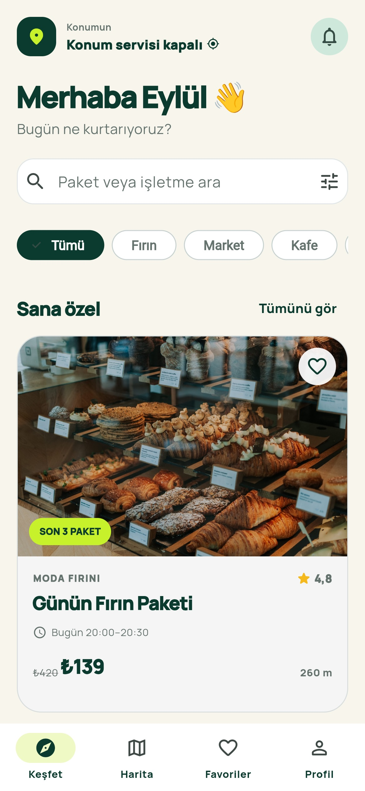
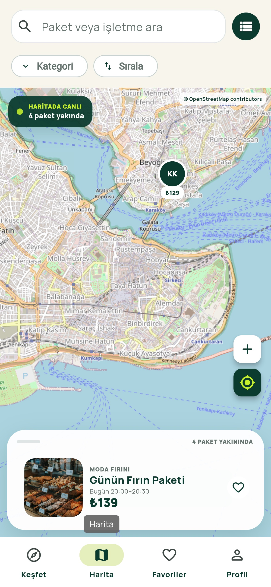
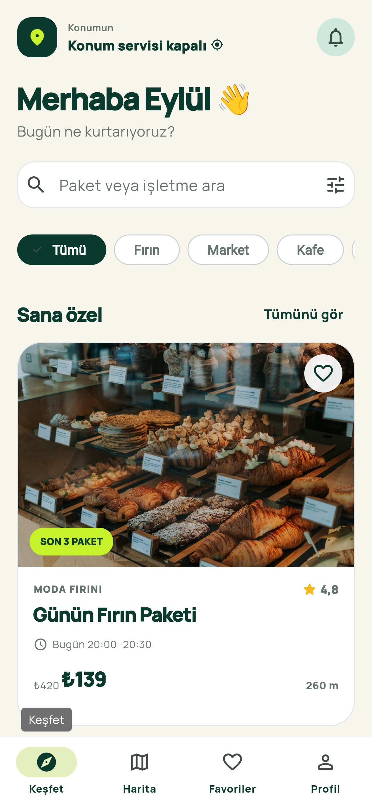
</div>

<div align="center">

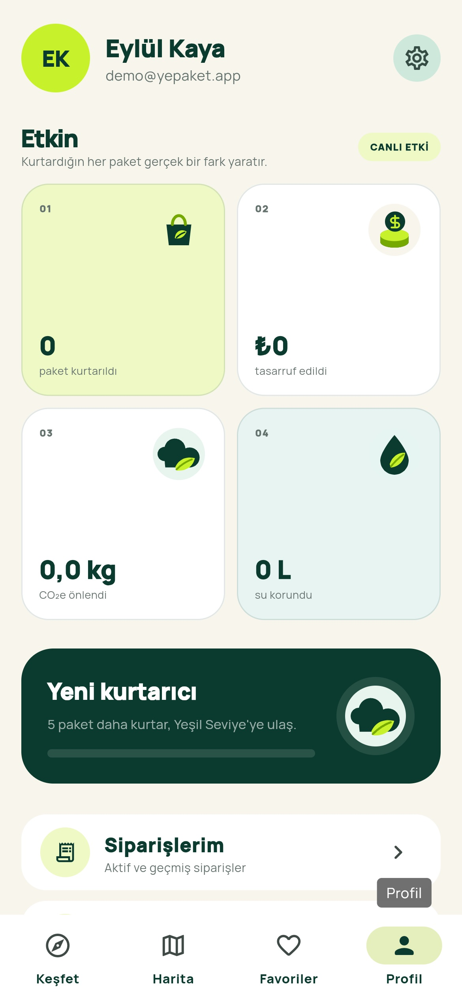
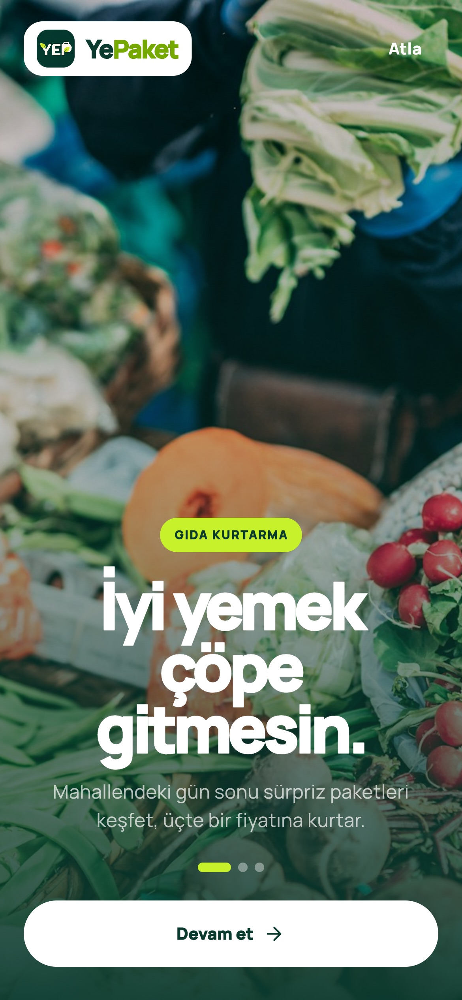
</div>

Konuma göre paket keşfi · PostGIS ile mesafe sıralaması · gerçek koordinatlı
canlı harita · WebSocket ile anlık stok güncellemesi · 3D Secure ödeme ·
tek kullanımlık kodla teslim · kişisel çevresel etki takibi

### Tanıtım sitesi

<div align="center">
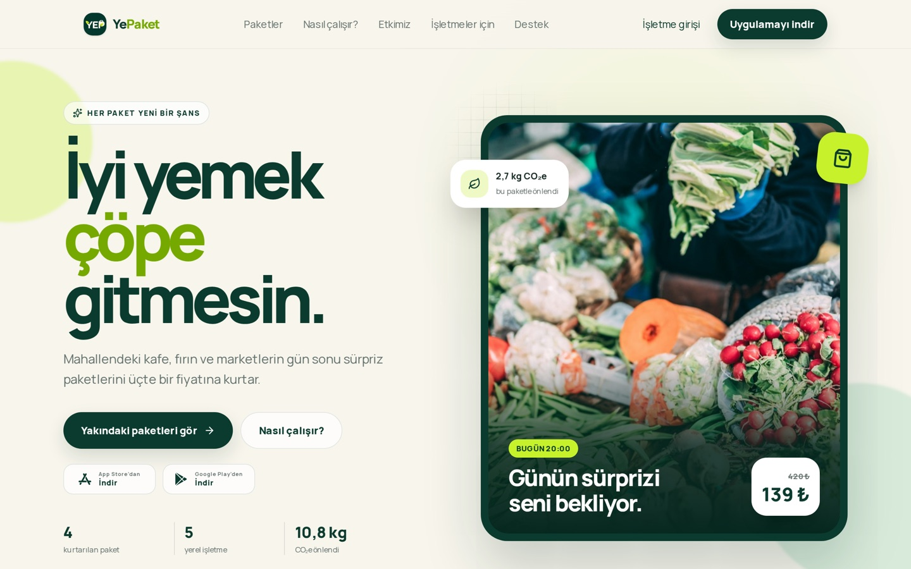
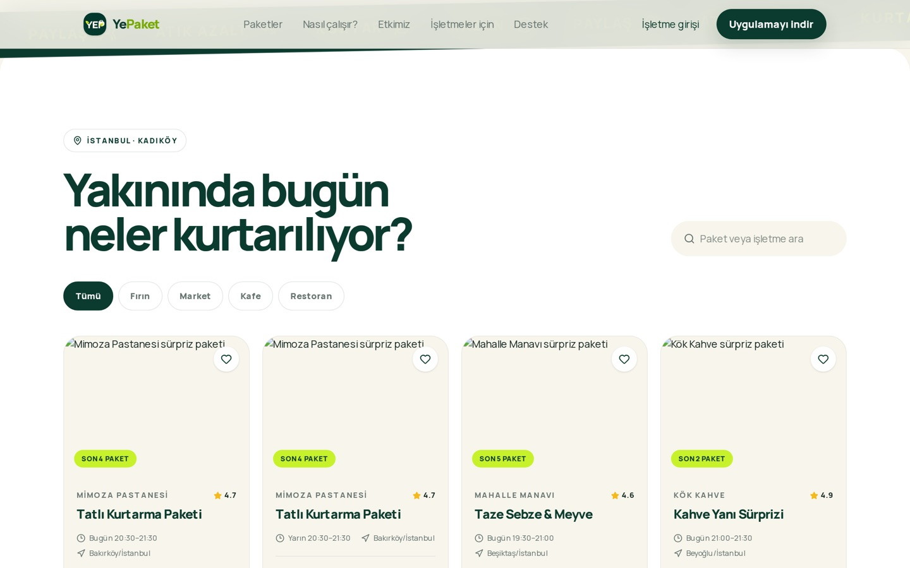
</div>

Sunucu tarafında render edilir (React 19 RSC): paketler arama motorlarına ve
JavaScript'i geç yüklenen ziyaretçilere de görünür.

### MyStore — işletme paneli

<div align="center">
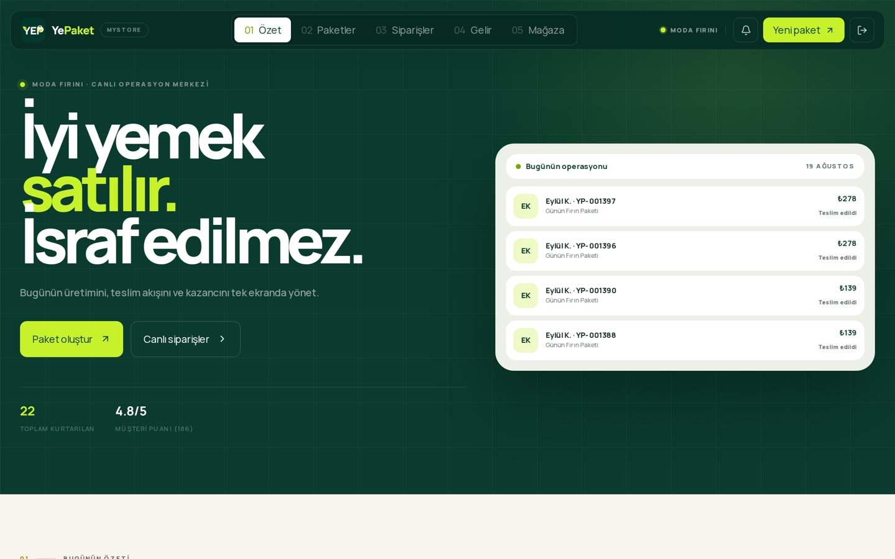
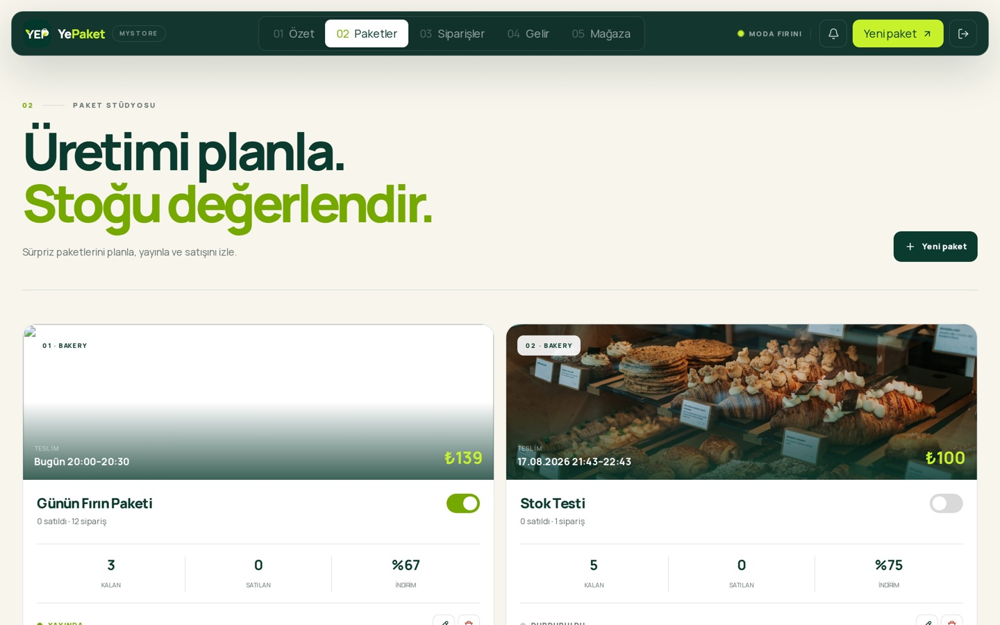
</div>

<div align="center">
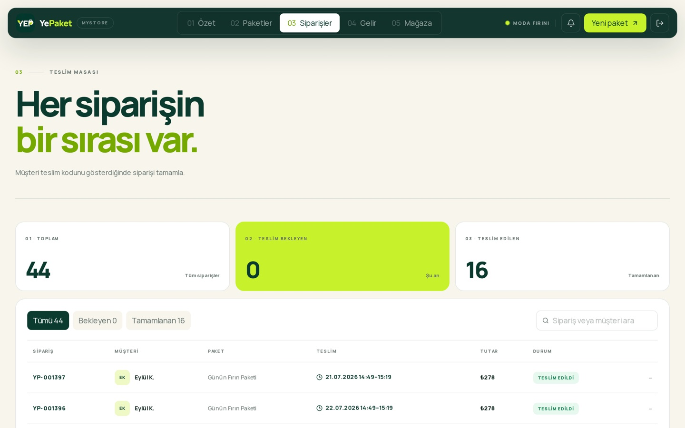
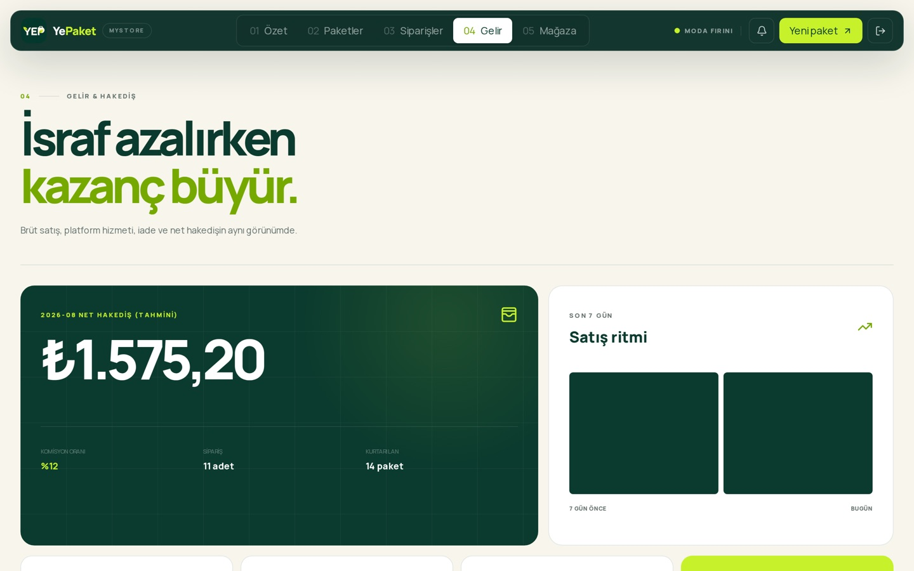
</div>

Paket yayınlama ve stok düzeltme · canlı sipariş akışı · teslim kodu doğrulama ·
komisyon düşülmüş hakediş özeti · çok kullanıcılı erişim (sahip/yönetici/personel)

---

## Teknik olarak ilginç kısımlar

Bu bir CRUD uygulaması değil: aynı paketin son adedi için iki kişi aynı anda
ödeme yapabilir, ödeme sağlayıcısı yanıtı gecikebilir, kullanıcı teslim
kodunu ekran görüntüsüyle paylaşabilir. Aşağıdakiler bu yüzden var.

### Aşırı satış imkânsız

Stok düşümü uygulama katmanında değil, veritabanında `SELECT ... FOR UPDATE`
satır kilidiyle yapılır. Kilit alındıktan **sonra** okunan değer güncel olmak
zorundadır.

```sql
SELECT id, available_quantity, status FROM bags WHERE id = $1 FOR UPDATE
```

Ek olarak `available_quantity >= 0` bir veritabanı CHECK kısıtıdır: uygulamada
bir hata olsa bile stok negatife düşemez.

> **Test:** 3 stoklu bir pakete 10 eşzamanlı istek → tam olarak 3 sipariş
> oluşur, 7'si `INSUFFICIENT_STOCK` alır, stok 0'da kapanır.

### Çift tahsilat imkânsız

Para hareketi içeren uçlar `Idempotency-Key` başlığı ister. Kayıtlar Redis'te
değil **veritabanında** tutulur — bellek baskısı altında kaybolmamalıdır.
Aynı anahtar + aynı gövde ilk isteğin yanıtını döndürür; aynı anahtar + farklı
gövde `409` verir.

### Para hesabı şaşmaz

Tüm parasal alanlar **tam sayı kuruş**tur (`totalMinor`, `commissionMinor`).
Hiçbir katmanda kayan noktalı sayı kullanılmaz. Toplamlar 32 ayrı CHECK
kısıtıyla doğrulanır:

```
total = unit × qty        net = total − commission
```

Komisyon oranı sipariş anında dondurulur; sonradan yapılan oran değişikliği
geçmiş hakedişi değiştiremez.

### Çalınan oturum kullanılamaz

- Yenileme jetonu opaktır, **her kullanımda döner** ve sunucuda yalnızca HMAC
  özeti saklanır
- Kullanılmış bir jeton ikinci kez sunulursa kullanıcının **tüm** oturumları
  kapatılır (hırsızlık sinyali)
- Oturum iptal edildiğinde erişim jetonu **anında** geçersizleşir — Redis kara
  listesi, jetonun süresi dolmasını beklemez
- Aynı kontrol WebSocket bağlantılarında da yapılır ve dakikada bir tekrarlanır

### Teslim doğrulaması atlanamaz

Teslim onayı için sunucudan **tek kullanımlık nonce** alınır; sunucu teslim
aralığını kendi saatine göre doğrular. Nonce hash'lenmiş saklanır ve bir kez
kullanılır. Ekran görüntüsü paylaşmak işe yaramaz.

### Olay kaybolmaz

Stok değişimi ve sipariş durumu **outbox deseni** ile yayınlanır: olay iş
transaction'ının içinde veritabanına yazılır, ayrı bir süreç
`FOR UPDATE SKIP LOCKED` ile okuyup Redis pub/sub'a taşır. "Veritabanı yazıldı
ama olay yayınlanmadı" durumu oluşamaz.

### Coğrafi sorgular

Yakınlık sorguları PostGIS ifade indeksi üzerinden çalışır:

```sql
CREATE INDEX stores_location_gix ON stores
USING GIST ((ST_SetSRID(ST_MakePoint(longitude, latitude), 4326)::geography));
```

Türkçe arama için `pg_trgm` (yazım hatasına toleranslı) ve `unaccent`;
sıralama için ICU `tr-TR` derlemesi (ı/İ/ş/ğ doğru sıralanır).

---

## Mimari

```
                    ┌──────────────┐
   Flutter app ────▶│              │
                    │              │──▶ PostgreSQL 17 + PostGIS
   React web   ────▶│  NestJS API  │
                    │   (REST)     │──▶ Redis 7  (oturum, hız sınırı, pub/sub)
   İşletme     ────▶│              │
   paneli           └──────┬───────┘──▶ iyzico  (3D Secure)
                           │
                     Socket.IO ──▶ canlı stok / sipariş durumu
```

| Katman | Seçim | Gerekçe |
|---|---|---|
| API | NestJS 11 + TypeScript | Web ile tek dil; olgun modül/DI yapısı |
| Veritabanı | PostgreSQL 17 + PostGIS | Coğrafi sorgu **ve** satır kilidiyle atomik stok — ikisi tek yerde |
| Cache | Redis 7 | Oturum kara listesi, hız sınırı, gerçek zamanlı olay dağıtımı |
| Ödeme | iyzico | Türkiye pazarı, 3D Secure, alt üye işyeri (pazaryeri) modeli |
| Web | React 19 RSC + vinext | Sunucu tarafı render, hızlı ilk boyama |
| Mobil | Flutter 3.44 | Tek kod tabanından iOS + Android |

Ödeme sağlayıcısı `PaymentProvider` arayüzünün arkasındadır; değişimi tek
modülü etkiler.

---

## Kapsam

**Tüketici:** kayıt · e-posta ve sosyal giriş (Google/Apple) · şifre sıfırlama ·
konuma göre keşif · harita · kategori ve 5 sıralama seçeneği · favoriler ·
sipariş · 3D Secure ödeme · nonce ile teslim · arkadaşa teslim devri · iptal ve
iade · değerlendirme · çevresel etki · bildirimler ve tercihleri · destek
talebi · hesap kapatma (KVKK)

**İşletme:** ön kayıt başvurusu · panel özeti · paket yayınlama, stok düzeltme,
yayına alma/durdurma, silme · sipariş takibi · teslim onayı · hakediş özeti ·
mağaza profili · çok kullanıcılı erişim

**Yönetim (API):** başvuru onayı (onayda işletme otomatik oluşur) · işletme
durumu ve komisyon · hakediş üretme ve ödendi işaretleme · destek talepleri ·
denetim kaydı

**82 uç nokta.** Tam liste: [`docs/API_CONTRACT.md`](docs/API_CONTRACT.md) —
çalışan uygulamadan üretilir (`npm run openapi`).

---

## Çalıştırma

Gereksinim: Docker. Node ve Flutter yalnızca ilgili istemci üzerinde
çalışacaksanız gerekir.

```bash
# 1. Altyapı (PostgreSQL + PostGIS, Redis, Mailpit)
cd infra && cp .env.example .env && docker compose up -d

# 2. Backend
cd ../backend && cp .env.example .env
npm install && npm run db:migrate && npm run db:seed && npm run start:dev

# 3. Web
cd ../web && npm install && npm run dev

# 4. Mobil
cd ../mobile && flutter pub get && flutter run
```

Seed demo veri kurar — gerçek veri yoktur:

```
admin@yepaket.app  ·  demo@yepaket.app  ·  demo@modafirini.com
şifre: demo1234
```

Adresler: API `:8080` · web `:3000` · Swagger `:8080/v1/docs` ·
Mailpit `:8025`

### Üretim

```bash
cd infra
cp .env.prod.example .env.prod   # sırları doldurun
docker compose -f docker-compose.prod.yml --env-file .env.prod up -d --build
```

Yığın: PostgreSQL · Redis · migration · API · web · Caddy (Let's Encrypt ile
otomatik TLS). Ayrıntı: [`docs/TESLIM.md`](docs/TESLIM.md)

---

## Testler

```bash
cd backend  && npm test && npm run test:e2e   # 20 birim + 83 uçtan uca
cd ../web   && npm run lint && npm test
cd ../mobile && flutter analyze && flutter test   # 26 test
```

Toplam **129 test**: 20 birim + 83 uçtan uca (backend) + 26 birim (mobil).

Uçtan uca testler gerçek PostgreSQL ve Redis'e karşı çalışır; eşzamanlılık,
idempotency, jeton hırsızlığı, şifre sıfırlama, teslim doğrulaması ve WebSocket
yetkilendirmesi dâhil.

---

## Depo yapısı

```
backend/    NestJS API — 82 uç, Prisma şeması, migration'lar, testler
web/        Tanıtım sitesi + MyStore paneli (React 19 RSC, Tailwind v4)
mobile/     Flutter iOS/Android tüketici uygulaması
infra/      Docker Compose — yerel geliştirme ve üretim yığını
docs/       API sözleşmesi, mimari, kurulum ve teslim dokümanı
```

| Doküman | İçerik |
|---|---|
| [docs/API_CONTRACT.md](docs/API_CONTRACT.md) | 82 ucun tamamı, hata kodları, akışlar |
| [docs/ARCHITECTURE.md](docs/ARCHITECTURE.md) | Mimari kararlar ve veri akışları |
| [docs/LOCAL_DEV.md](docs/LOCAL_DEV.md) | Yerelde çalıştırma |
| [docs/TESLIM.md](docs/TESLIM.md) | Yayına alma ve işletim |

---

## Notlar

- Depoda **gerçek veri, gizli anahtar veya veritabanı dökümü yoktur.**
  `.env` dosyaları hariç tutulmuştur; `prisma/seed.ts` demo kayıt üretir.
- Ekran görüntülerindeki bütün sayılar bu demo veriden gelir.
- Harita döşemeleri geliştirmede OpenStreetMap'tendir. OSM Kullanım Politikası
  bunu üretim uygulamalarında yasaklar; yayına çıkarken `MAP_TILE_URL` ticari
  bir sağlayıcıya çevrilmelidir.
- Yasal metinler (KVKK aydınlatma, kullanım koşulları) ürünün işleyişine göre
  yazılmış **taslaklardır**; yayın öncesi hukuki inceleme gerekir.

## Lisans

MIT — bkz. [LICENSE](LICENSE)
